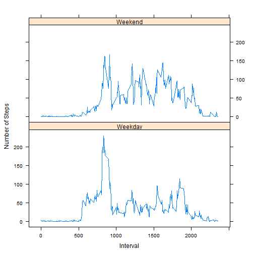

*Author : Chau Nam Ky Nguyen*  
*Date : 14th November, 2014*  
*Course: Reproduciple research* 

---------------------------------------------------------

### Loading and preprocessing the data

1.Loading data


```r
data <- read.csv ("D:/Work/DataScience/05_Reproducible_Research/repdata-data-activity/activity.csv")
summary (data)
```

```
##      steps                date          interval     
##  Min.   :  0.00   2012-10-01:  288   Min.   :   0.0  
##  1st Qu.:  0.00   2012-10-02:  288   1st Qu.: 588.8  
##  Median :  0.00   2012-10-03:  288   Median :1177.5  
##  Mean   : 37.38   2012-10-04:  288   Mean   :1177.5  
##  3rd Qu.: 12.00   2012-10-05:  288   3rd Qu.:1766.2  
##  Max.   :806.00   2012-10-06:  288   Max.   :2355.0  
##  NA's   :2304     (Other)   :15840
```
2.Preprocessing the data: Convert the type of the column "date" from "Factor" to "Date"

```r
date_tmp <- as.Date(data$date)
data$date <- date_tmp 
str (data)
```

```
## 'data.frame':	17568 obs. of  3 variables:
##  $ steps   : int  NA NA NA NA NA NA NA NA NA NA ...
##  $ date    : Date, format: "2012-10-01" "2012-10-01" ...
##  $ interval: int  0 5 10 15 20 25 30 35 40 45 ...
```

### What is mean total number of steps taken per day?

1.Make a histogram of the total number of steps taken each day


```r
sum_result <- aggregate (steps ~ date, data = data, FUN = sum)
par (mfrow = c(1,1))
hist (sum_result$steps, xlab = "Steps", ylab = "Number of Date", col = "Blue", main = "")
```

 

2.Calculate and report the mean and median total number of steps taken per day


```r
median_result <- aggregate (steps ~ date, data = data, FUN = median)
mean_result   <- aggregate (steps ~ date, data = data, FUN = mean)
total_result  <- merge (mean_result, median_result, by = c ("date","date"))
names (total_result) <- c("date","mean","median")
head (total_result)
```

```
##         date     mean median
## 1 2012-10-02  0.43750      0
## 2 2012-10-03 39.41667      0
## 3 2012-10-04 42.06944      0
## 4 2012-10-05 46.15972      0
## 5 2012-10-06 53.54167      0
## 6 2012-10-07 38.24653      0
```


### What is the average daily activity pattern?

1. Make a time series plot of the 5-minute interval (x-axis) and the average number of steps taken, averaged across all days (y-axis)


```r
mean_interval <- aggregate (steps ~ interval, data = data, FUN = mean)
plot (mean_interval$step ~ mean_interval$interval,type = "l", xlab = "Interval", ylab = "Average Step", col = "Green")
```

 


2.Which 5-minute interval, on average across all the days in the dataset, contains the maximum number of steps?


```r
mean_interval[mean_interval$step == max (mean_interval$step),]
```

```
##     interval    steps
## 104      835 206.1698
```

### Imputing missing values

1.Calculate and report the total number of missing values in the dataset


```r
a <- sum(is.na (data))
```

**The total of NA rows is 2304**  

2.Devise a strategy for filling in all of the missing values in the dataset

*The Stratergy is : Imputing missing values by assigning the mean of all intervals to a missing date*


```r
na_date <- unique(data[is.na (data),2])

new_data <- data

for (i in na_date) 
    new_data [new_data$date == i,"steps"] = as.integer (mean_interval[,2])

new_sum_result <- aggregate (steps ~ date, data = new_data, FUN = sum)
```
3.Create a new dataset that is equal to the original dataset but with the missing data filled in.

*Show only previous missing date with new data*


```r
head (subset (new_data, date %in% na_date),5)
```

```
##   steps       date interval
## 1     1 2012-10-01        0
## 2     0 2012-10-01        5
## 3     0 2012-10-01       10
## 4     0 2012-10-01       15
## 5     0 2012-10-01       20
```


4a.Report the mean and median total number of steps taken per day

Calculate the new median and mean 


```r
new_median_result <- aggregate (steps ~ date, data = new_data, FUN = median)
new_mean_result   <- aggregate (steps ~ date, data = new_data, FUN = mean)
```

Add median and mean of missing days


```r
tmp <- as.data.frame (cbind(as.character (na_date), matrix (NA, 8,2)))

tmp[,1] <- as.Date    (tmp[,1])
tmp[,2] <- as.numeric (tmp[,2])
tmp[,3] <- as.numeric (tmp[,3])

names (tmp)          <- c("date","mean","medium")
names (total_result) <- c("date","mean","medium")

total_result <- rbind (total_result,tmp)
```

Report the mean and median of original and new data


```r
total_result <- total_result[order (total_result$date),]

total_result <- merge (total_result, new_mean_result  , by = c("date","date"))
total_result <- merge (total_result, new_median_result, by = c("date","date"))

names (total_result) <- c("date","old mean","old medium","new mean","new medium")

head (total_result)
```

```
##         date old mean old medium new mean new medium
## 1 2012-10-01       NA         NA 36.94792       33.5
## 2 2012-10-02  0.43750          0  0.43750        0.0
## 3 2012-10-03 39.41667          0 39.41667        0.0
## 4 2012-10-04 42.06944          0 42.06944        0.0
## 5 2012-10-05 46.15972          0 46.15972        0.0
## 6 2012-10-06 53.54167          0 53.54167        0.0
```

4b. Make a histogram of the total number of steps taken each day and Calculate  


```r
par (mfrow = c(1,2))

hist (sum_result$steps    , xlab = "Steps", ylab = "Number of Date", col = "Blue", main = "Original")
hist (new_sum_result$steps, xlab = "Steps", ylab = "Number of Date", col = "Cyan", main = "New")
```

 

Do these values differ from the estimates from the first part of the assignment? 
*Yes, the date is different. Missing dates now are shown in the histogram*

What is the impact of imputing missing data on the estimates of the total daily number of steps?
*As the above figure, the number of days is increased from 25 to 35*


### Are there differences in activity patterns between weekdays and weekends?

1.Create a new factor variable in the dataset with two levels - "weekday" and "weekend" indicating whether a given date is a weekday or weekend day

Find weekday in data


```r
tmp <- weekdays (new_data$date)
tmp <- sapply (tmp,function(x) if (x %in% c("Saturday","Sunday")) "Yes" else "No")

new_data <- cbind (new_data, weekend = tmp)

weekend_data <- subset (new_data, weekend == "Yes")
weekday_data <- subset (new_data, weekend == "No")
```

Calculate the average of steps according to "Weekend" or "Weekday"


```r
weekday_mean <- aggregate (steps ~ interval, data = weekday_data, FUN = mean)
weekend_mean <- aggregate (steps ~ interval, data = weekend_data, FUN = mean)
```

Create a new variable that has 2 levels : "Weekend" and "Weekday" and plot the result


```r
weekend_mean <- cbind (weekend_mean, c ("Weekend")) 
weekday_mean <- cbind (weekday_mean, c ("Weekday"))

names (weekday_mean) <- c("interval","mean","date")
names (weekend_mean) <- c("interval","mean","date")

tmp <- rbind (weekday_mean, weekend_mean)

str (tmp)
```

```
## 'data.frame':	576 obs. of  3 variables:
##  $ interval: int  0 5 10 15 20 25 30 35 40 45 ...
##  $ mean    : num  2.1556 0.4 0.1556 0.1778 0.0889 ...
##  $ date    : Factor w/ 2 levels "Weekday","Weekend": 1 1 1 1 1 1 1 1 1 1 ...
```

2.Make a panel plot containing a time series plot of the 5-minute interval (x-axis) and the average number of steps taken, averaged across all weekday days or weekend days (y-axis). 


```r
library (lattice)
px <- xyplot (mean ~ interval | date, data = tmp, type = "l", ylab = "Number of Steps", xlab = "Interval", layout = c(1,2))
print (px)
```

 
